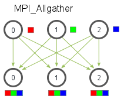

# Uvod

## Avtorji

Aleks Stepančič, Gašper Spagnolo, Marcel Ručigaj

## Problem

Problem n teles je klasičen problem v fiziki, kemiji in drugih področjih, saj z njim lahko opišemo mnogo interakcij v naravi (npr. med molekulami, nebesnimi telesi, ...). Danih imamo n teles, za vsakega pa podano še maso, začetni položaj in začetno hitrost. Telesa eno na drugo delujejo s gravitacijsko silo, torej se privlačijo. Zanima nas, kako se bo položaj in hitrost teles spreminjal skozi čas.  

Za določitev premika in spremembe hitrosti telesa je potrebno izračunati razdaljo in smer do vsakega drugega telesa v sistemu. Kompleksnost problema z večanjem števila teles hitro narašča: za vsako telo je treba izračunati n^2 sil. Problem je zato visoko paralelen, z ustrezno paralelizacijo pa bi lahko problem pohitrili za pomemben faktor.

<div style="page-break-after: always;"></div>  

# Sekvenčni algoritem

Najprej izpeljimo skevenčni algoritem, ki bo služil kot osnova za vse paralelizacije.  

Najprej ugotovimo, da bomo morali v vsaki različici programa vse iteracije (ena iteracija pomeni premik v eni časovni enoti) izvajati eno za drugo. Za izračun spremembe stanja vsakega telesa moramo namreč poznati vsa stanja teles v prejšnji iteraciji.  

## Metoda main  

```c
int main(int argc, char *argv[]) {
    // inicializacija
    Body **bodies;
    FILE *fp;
    int N_BODIES, N_ITER;

    if(argc != 3) {
        printf("Usage: %s <num_bodies> <num_iterations>\n", argv[0]);
        exit(1);
    }

    N_BODIES = atoi(argv[1]);
    N_ITER = atoi(argv[2]);

    fp = fopen(LOG_FILE, "wa");

    if (fp == NULL)
        throw_err(__LINE__, errno);

    // naključno genereriramo začetna stanja teles
    bodies = generate_initial_population(N_BODIES, 30, 3, 3);

    gettimeofday(&tv1, NULL);

    // izvedemo zeljeno stevilo iteracij
    for(int i = 0; i < N_ITER; i ++) {

        // vsako 100. iteracijo zapisemo v datoteko
        if (i % 100 == 0) {
            print_boddies(bodies, N_BODIES, i, fp);
        }

        // izracunamo stanja v naslednji iteraciji
        bodies = calculate_iteration(bodies, N_BODIES);
    }

    gettimeofday(&tv2, NULL);

    printf ("CPU: %f seconds\n", (float) (tv2.tv_usec - tv1.tv_usec) / 1000000 +
         (float) (tv2.tv_sec - tv1.tv_sec));

    print_boddies(bodies,N_BODIES, N_ITER, fp);

    cleanup(bodies, N_BODIES);
    fclose(fp);
    return 0;
}
```  

## Izračun naslednje iteracije  

Izračun naslednje iteracije delamo v *for* zanki za vsako telo (indeks i). Znotraj izračuna spremembe stanja za vsako telo, delo razdelimo v še eno zanko - ta računa sile, s katerimi vsako drugo telo deluje na trenutno telo.  


```c
Body **calculate_iteration(Body** bodies, int num_bodies) {
    Body** new_bodies = (Body**) malloc(num_bodies * sizeof(Body*));
    if(new_bodies == NULL)
        throw_err(__LINE__, 1);
    for (int i = 0; i < num_bodies; i++) {
        new_bodies[i] = malloc(sizeof(Body));
        if(new_bodies[i] == NULL)
            throw_err(__LINE__, 1);
        float forceX = 0;
        float forceY = 0;
        float forceZ = 0;
        for (int j = 0; j < num_bodies; j++) {
            float rx = bodies[j]->x - bodies[i]->x;
            float ry = bodies[j]->y - bodies[i]->y;
            float rz = bodies[j]->z - bodies[i]->z;
            float distance = sqrt(pow(rx, 2) + pow(ry, 2) + pow(rz, 2));

            forceX += bodies[j]->mass * rx / (pow(distance, 3) + EPSILON);
            forceY += bodies[j]->mass * ry / (pow(distance, 3) + EPSILON);
            forceZ += bodies[j]->mass * rz / (pow(distance, 3) + EPSILON);
        }      

        forceX *= G * bodies[i]->mass;  
        forceY *= G * bodies[i]->mass;  
        forceZ *= G * bodies[i]->mass;  

        float ax = forceX / bodies[i]->mass;
        float ay = forceY / bodies[i]->mass;
        float az = forceZ / bodies[i]->mass;

        new_bodies[i]->mass = bodies[i]->mass;
        new_bodies[i]->vx = bodies[i]->vx + ax * DT;
        new_bodies[i]->vy = bodies[i]->vy + ay * DT;
        new_bodies[i]->vz = bodies[i]->vz + az * DT;
        new_bodies[i]->x = bodies[i]->x + bodies[i]->vx * DT + 0.5 * ax * pow(DT, 2);
        new_bodies[i]->y = bodies[i]->y + bodies[i]->vy * DT + 0.5 * ay * pow(DT, 2);
        new_bodies[i]->z = bodies[i]->z + bodies[i]->vz * DT + 0.5 * az * pow(DT, 2);

    }

    cleanup(bodies, num_bodies);
    return new_bodies;
}

```

<div style="page-break-after: always;"></div>  

# Sekvenčni algortiem - drugič

Ker za sile med telesi velja Fij = -Fji, lahko naredimo pol manj izračnov, vendar za to potrenujemo skoraj n-krat več prostora.

Program poteka podobno, le da moramo na začetku alocirati še matriko, ki bo držala vse sile med telesi:

```c
bodies = generate_initial_population(N_BODIES, 30, 3, 3);

Force ***forces = malloc(sizeof(Force **) * N_BODIES);
for(int i = 0; i < N_BODIES; i++) {
    forces[i] = malloc(sizeof(Force *) * N_BODIES);
    for(int j = 0; j < i; j++) {
        forces[i][j] = malloc(sizeof(Force));
    }
}

for(int i = 0; i < N_ITER; i ++) {
    if (i % 100 == 0) {
        print_boddies(bodies, N_BODIES, i, fp);
    }
    bodies = calculate_iteration(bodies, forces, N_BODIES);
}
```

Izračun iteracije se sedaj spremeni tako, da najprej izračunamo vse sile med vsemi telesi in jih šele nato seštevamo:

```c
Body **calculate_iteration(Body** bodies, Force ***forces,  int num_bodies) {
    Body **new_bodies = malloc(sizeof(Body *) * num_bodies);
    for (int i = 0; i < num_bodies; i++) {
        for (int j =0; j < i;  j++) {
            float rx = bodies[j]->x - bodies[i]->x;
            float ry = bodies[j]->y - bodies[i]->y;
            float rz = bodies[j]->z - bodies[i]->z;
            float distance = sqrt(pow(rx, 2) + pow(ry, 2) + pow(rz, 2));
            forces[i][j]-> fx = bodies[j]->mass * rx / (pow(distance, 3) + EPSILON);
            forces[i][j]-> fy = bodies[j]->mass * ry / (pow(distance, 3) + EPSILON);
            forces[i][j]-> fz = bodies[j]->mass * rz / (pow(distance, 3) + EPSILON);
        }      
    }
    for(int i = 0; i < num_bodies; i++) {
        float forceX = 0;
        float forceY = 0;
        float forceZ = 0;

        for(int j = 0; j < i; j++) {
            forceX += forces[i][j]->fx;
            forceY += forces[i][j]->fy;
            forceZ += forces[i][j]->fz;
        }

        for(int j = i+1; j < num_bodies; j++) {
            forceX -= forces[j][i]->fx;
            forceY -= forces[j][i]->fy;
            forceZ -= forces[j][i]->fz;
        }

        forceX *= G * bodies[i]->mass;  
        forceY *= G * bodies[i]->mass;  
        forceZ *= G * bodies[i]->mass;


        float ax = forceX / bodies[i]->mass;
        float ay = forceY / bodies[i]->mass;
        float az = forceZ / bodies[i]->mass;

        new_bodies[i] = malloc(sizeof(Body)); 
        new_bodies[i]->mass = bodies[i]->mass;

        new_bodies[i]->vx = bodies[i]->vx + ax * DT;
        new_bodies[i]->vy = bodies[i]->vy + ay * DT;
        new_bodies[i]->vz = bodies[i]->vz + az * DT;

        new_bodies[i]->x = bodies[i]->x + bodies[i]->vx * DT + 0.5 * ax * pow(DT, 2);
        new_bodies[i]->y = bodies[i]->y + bodies[i]->vy * DT + 0.5 * ay * pow(DT, 2);
        new_bodies[i]->z = bodies[i]->z + bodies[i]->vz * DT + 0.5 * az * pow(DT, 2);

    }
    cleanup(bodies, num_bodies);
    return new_bodies;
}
```

<div style="page-break-after: always;"></div> 

## Primerjava obeh sekvenčnih programov

| n_bodies | n_steps | time1 | time2  |
| --- | --- | --- | --- | 
| 100 | 100 | 0.0134 | 0.0083 |
| 100 | 1000 | 0.1262 | 0.0824 |
| 100 | 10000 | 1.2691 | 0.827 |
| 1000 | 100 | 1.2722 | 2.3533 |
| 1000 | 1000 | 12.6684 | 23.8356 |
| 1000 | 10000 | 127.11 | 234.58 |
| 10000 | 100 | 126.47 |  |

Ko je število teles majhno, je drugi program boljši, ko se število teles veča, pa število dostopov do pomnilnika in čas, ki ga s tem izgubimo, preseže čas, ki ga prihranimo z manj računanja. Za velike probleme je torej boljša prva verzija algoritma, ki ne izkoristi dejstva Fij = -Fji.


<div style="page-break-after: always;"></div>  

# Paralelizacija z večnitenjem - Pthreads

## Prvi način

V funkciji *main* naredimo *for* zanko, ki gre čez iteracije. Znotraj zanke vsakič ustvarimo niti, vsaka nit izračuna svoj del, potem pa niti pridružimo in nadaljujemo z naslednjo iteracijo.

Funkcija *main*:

```c
    // create starting population
    bodies = generate_initial_population(N_BODIES, 30, 3, 3);
    
    // initialize thread args
    for(int i = 0; i < N_THREADS; i++) {
        thread_args[i].tid = i;
        thread_args[i].bodies = bodies;
        thread_args[i].n_bodies = N_BODIES;
        thread_args[i].start = i * N_BODIES / N_THREADS;
        thread_args[i].end = (i + 1) * N_BODIES / N_THREADS;
    }

    for(int i = 0; i < N_ITER; i ++) {
        
        if(i % 100 == 0) {
            print_boddies(bodies, N_BODIES, i, fp);
        }

        // Compute iteration
        for(int j = 0; j < N_THREADS; j++)
            if(pthread_create(&threads[j], NULL, parallel_iteration, (void *) &thread_args[j]) != 0)
                throw_err(__LINE__, errno);

        // Join threads
        for(int j = 0; j < N_THREADS; j++){
            void *thread_result;
            if(pthread_join(threads[j], &thread_result) != 0)
                throw_err(__LINE__, errno);
            else {
               ThreadArgs *args = (ThreadArgs *) thread_result;
               memcpy(&thread_args[args->tid], args, sizeof(ThreadArgs));
            }
        }
        cleanup(bodies, N_BODIES); // fix the memory leak

        // Join bodies arrays
        for(int j = 0; j < N_THREADS; j++)
            for(int k = thread_args[j].start; k < thread_args[j].end; k++)
                bodies[k] = thread_args[j].bodies[k - thread_args[j].start]; 
        
        
        // Update bodies array for every thread
        for(int j = 0; j < N_THREADS; j++) {
            free(thread_args[j].bodies);
            thread_args[j].bodies = bodies;
        }

    }
```

Funkcija *parallel_iteration*, ki jo izvaja ena nit:

```c
void *parallel_iteration(void *arg) {
    ThreadArgs *args = (ThreadArgs *) arg;
    Body **new_bodies = calculate_iteration(args->bodies, args->n_bodies, args->start, args->end);
    args->bodies = new_bodies;
    pthread_exit((void*) args); 
}
```

*calculate_iteration* je ista kot v sekvenčnem programu, le da zdaj računa spremembe stanj teles z indeksi na intervalu [*args->start*, *args->end*].  

## Drugi način

Prvi način nitenja s Pthreads je morda neučinkovit, ker v vsaki iteraciji ustvarjamo in uničujemo niti. To smo poskusili odpraviti:

```c
Body *calculate_iteration(Body* bodies, int num_bodies, int start, int end) {
    int n_bodies_to_process = end - start;
    Body* new_bodies = (Body*) malloc((n_bodies_to_process) * sizeof(Body));
    
    ...
    
    return new_bodies;
}

void *parallel_iteration(void *arg) {
    ThreadData *thread_descriptor = (ThreadData *) arg;
    ThreadData master_descriptor = thread_data_g[0];

    fflush(stdout);

    for(int i = 0; i < thread_descriptor->n_iter; i++) { 
        thread_descriptor->new_bodies = calculate_iteration(thread_descriptor->bodies, thread_descriptor->n_bodies, thread_descriptor->start, thread_descriptor->end); 
        
        // copy all bodies from new_bodies to bodies of the master thread
        memcpy(&master_descriptor.bodies[thread_descriptor->start], thread_descriptor->new_bodies, (thread_descriptor->end - thread_descriptor->start) * sizeof(Body));

        free(thread_descriptor->new_bodies);
        
        thread_descriptor->bodies = master_descriptor.bodies;

        pthread_barrier_wait(&barrier);

        if(thread_descriptor->tid == 0 && i % 100 == 0) {
            print_boddies(master_descriptor.bodies, master_descriptor.n_bodies, i, fp);
        }
    }


    return NULL;
}

int main(int argc, char *argv[]) {
    
    ...

    bodies = generate_initial_population(N_BODIES, 30, 3, 3);
    
    // initialize thread data 
    for(int i = 0; i < N_THREADS; i++) {
        thread_data_g[i].tid = i;
        thread_data_g[i].bodies = bodies;
        thread_data_g[i].n_bodies = N_BODIES;
        thread_data_g[i].start = i * N_BODIES / N_THREADS;
        thread_data_g[i].end = (i + 1) * N_BODIES / N_THREADS;
        thread_data_g[i].n_iter = N_ITER;
        thread_data_g[i].n_threads = N_THREADS;
    }

    ...

    // Compute iteration
    for(int j = 0; j < N_THREADS; j++)
        if(pthread_create(&threads[j], NULL, parallel_iteration, (void *) &thread_data_g[j]) != 0)
            throw_err(__LINE__, errno);

    // Join threads
    for(int j = 0; j < N_THREADS; j++)
        if(pthread_join(threads[j], NULL) != 0)
            throw_err(__LINE__, errno);

    ...

}
```

## Tretji način

Tretji način je bil zelo podoben drugemu, le da smo odpravili še vsakokratno alociranje seznama lastnosti teles, tako da ves čas uporabljali iste spremenljivke.

```c
void calculate_iteration(ThreadData *thread_descriptor) {
    
    ...
    
}

void *parallel_iteration(void *arg) {
    ThreadData *thread_descriptor = (ThreadData *) arg;
    ThreadData master_descriptor = thread_data_g[0];
    
    for(int i = 0; i < thread_descriptor->n_iter; i++) { 
        calculate_iteration(thread_descriptor);

        pthread_barrier_wait(&barrier);
        
        // copy all bodies from new_bodies to bodies of the master thread
        memcpy(&master_descriptor.bodies[thread_descriptor->start], thread_descriptor->thread_bodies, (thread_descriptor->end - thread_descriptor->start) * sizeof(Body));
 
        thread_descriptor->bodies = master_descriptor.bodies;

        pthread_barrier_wait(&barrier);

        if(thread_descriptor->tid == 0 && i % 100 == 0) {
            print_boddies(master_descriptor.bodies, master_descriptor.n_bodies, i, fp);
        }
    }

    return NULL;
}

int main(int argc, char *argv[]) {
   
    ...

}
```

<div style="page-break-after: always;"></div> 

## Rezultati

| n_bodies | n_steps | n_threads | time0 | time1 | time2
| --- | --- | --- | --- | --- | --- |
| 100 | 100 | 1 | 0.014233 | 0.008753 | 0.012160
| 100 | 100 | 2 | 0.013511 | 0.005356 | 0.008089
| 100 | 100 | 4 | 0.014494 | 0.004058 | 0.006176
| 100 | 100 | 8 | 0.027422 | 0.005069 | 0.008342
| 100 | 100 | 16 | 0.057227 | 0.005910 | 0.009925
| 100 | 100 | 24 | 0.077586 | 0.007531 | 0.013549

| n_bodies | n_steps | n_threads | time0 | time1 | time2
| --- | --- | --- | --- | --- | --- |
| 1000 | 100 | 1 | 0.846600 | 0.812971 | 1.226125
| 1000 | 100 | 2 | 0.537565 | 0.413167 | 0.625273
| 1000 | 100 | 4 | 0.288634 | 0.226370 | 0.414294
| 1000 | 100 | 8 | 0.213154 | 0.179878 | 0.265491
| 1000 | 100 | 16 | 0.158804 | 0.120838 | 0.152055
| 1000 | 100 | 24 | 0.162880 | 0.095325 | 0.126665

| n_bodies | n_steps | n_threads | time0 | time1 | time2
| --- | --- | --- | --- | --- | --- |
| 10000 | 100 | 4 | 22.661427 | 22.408664 | 33.667507
| 10000 | 100 | 8 | 14.261958 | 11.592130 | 17.324320
| 10000 | 100 | 16 | 11.509391 | 11.351132 | 13.995063
| 10000 | 100 | 24 | 7.901652 | 7.776366 | 9.537391

| n_bodies | n_steps | n_threads | time0 | time1 | time2
| --- | --- | --- | --- | --- | --- |
| 100000 | 100 | 8 | 1156.962800 | 1151.077168 | 1722.068115
| 100000 | 100 | 16 | 878.466339 | 874.805391 | 1208.428711
| 100000 | 100 | 24 | 770.176862 | 766.516877 | 953.110413


Opazimo, da je za veliko število teles drugi način rahlo boljši od prvega, tretji pa precej slabši.

<div style="page-break-after: always;"></div> 

## Primerjava sekvenčnega programa s Pthreads

Primerjajmo čase za 10000 teles in 100 iteracij. Pri Pthreads gledamo drugo verzijo programa, ki se je izkazala najbolje. 

```
ts = 126.47
```

| p | čas | pohitritev | učinkovitost |
| --- | --- | --- | --- |
| 4 | 22.41s | 5.64 | 1.41 |
| 8 | 11.59s | 10.91 | 1.36 |
| 16 | 11.35 | 11.14 | 0.70 |
| 24 | 7.78s | 16.26 | 0.68 |

<div style="page-break-after: always;"></div>  

# Paralelizacija z večnitenjem - OpenMP

```c
Body **calculate_iteration(Body** bodies, int num_bodies) {
    Body** new_bodies = (Body**) malloc(num_bodies * sizeof(Body*));
    if(new_bodies == NULL)
        throw_err(__LINE__, 1);

    #pragma omp parallel for schedule(dynamic, 10)
    for (int i = 0; i < num_bodies; i++) {
        
        ...

    }

    cleanup(bodies, num_bodies);
    return new_bodies;
}


int main(int argc, char *argv[]) {
    Body **bodies;
    FILE *fp;
    int N_BODIES, N_ITER;

    if(argc != 3) {
        printf("Usage: %s <num_bodies> <num_iterations>\n", argv[0]);
        exit(1);
    }

    #pragma omp parallel
    #pragma omp master

    ...

    bodies = generate_initial_population(N_BODIES, 30, 3, 3);

    for(int i = 0; i < N_ITER; i ++) {
        if (i % 100 == 0) {
            print_boddies(bodies, N_BODIES, i, fp);
        }
        bodies = calculate_iteration(bodies, N_BODIES);
    }
   
    ...

}
```

## Rezultati

Testirali smo tudi različne možnosti pri *#pragma parallel for*. Preizkusili smo vse kombinacije *static*, *dynamic* in *guided*, ter 1, 5, 10, 20, 50 na 8, 16 in 24 jedrih.

Strategije 0-4: static (1, 5, 10, 20, 50)  
Strategije 5-9: dynamic (1, 5, 10, 20, 50)  
Strategije 10-14: guided (1, 5, 10, 20, 50)  

| jeder | strategija | čas |
| --- | --- | --- |
| 8 | 0 | 21.089527 |
| 8 | 1 | 19.602837 |
| 8 | 2 | 19.432543 |
| 8 | 3 | 19.523254 |
| 8 | 4 | 19.284624 |
| 8 | 5 | 19.445204 |
| 8 | 6 | 19.593365 |
| 8 | 7 | 18.998045 |
| 8 | 8 | 19.307489 |
| 8 | 9 | 19.692074 |
| 8 | 10 | 19.157419 |
| 8 | 11 | 19.193727 |
| 8 | 12 | 19.154203 |
| 8 | 13 | 19.886925 |
| 8 | 14 | 19.939524 |

| jeder | strategija | čas |
| --- | --- | --- |
| 16 | 0 | 24.277969 |
| 16 | 1 | 16.786196 |
| 16 | 2 | 16.139584 |
| 16 | 3 | 15.588262 |
| 16 | 4 | 15.464186 |
| 16 | 5 | 13.810653 |
| 16 | 6 | 13.262261 |
| 16 | 7 | 12.486407 |
| 16 | 8 | 12.594163 |
| 16 | 9 | 12.475571 |
| 16 | 10 | 14.055889 |
| 16 | 11 | 13.683089 |
| 16 | 12 | 13.832859 |
| 16 | 13 | 13.685722 |
| 16 | 14 | 14.045515 |

| jeder | strategija | čas |
| --- | --- | --- |
| 24 | 0 | 17.421495 |
| 24 | 1 | 14.145296 |
| 24 | 2 | 11.953074 |
| 24 | 3 | 10.958787 |
| 24 | 4 | 11.053214 |
| 24 | 5 | 16.372280 |
| 24 | 6 | 12.880569 |
| 24 | 7 | 11.966436 |
| 24 | 8 | 11.388126 |
| 24 | 9 | 11.551367 |
| 24 | 10 | 10.755853 |
| 24 | 11 | 10.992288 |
| 24 | 12 | 10.823830 |
| 24 | 13 | 10.913774 |
| 24 | 14 | 11.166388 |

V splošnem se je za zelo dobro izkazala strategija 7: *(dynamic, 10)*. Od tu naprej smo uporabljali to.

### Časi pri različnih parametrih

| n_bodies | n_steps | n_threads | time |
| --- | --- | --- | --- |
| 100 | 100 | 1 | 0.024474 |
| 100 | 100 | 2 | 0.008635 |
| 100 | 100 | 4 | 0.006584 |
| 100 | 100 | 8 | 0.004472 |
| 100 | 100 | 16 | 0.004327 |
| 100 | 100 | 24 | 0.345345 |
| 100 | 1000 | 1 | 0.129204 |
| 100 | 1000 | 2 | 0.081089 |
| 100 | 1000 | 4 | 0.047296 |
| 100 | 1000 | 8 | 0.035851 |
| 100 | 1000 | 16 | 0.032883 |
| 100 | 1000 | 24 | 0.034667 |
| 1000 | 100 | 1 | 1.427507 |
| 1000 | 100 | 2 | 0.839148 |
| 1000 | 100 | 4 | 0.403707 |
| 1000 | 100 | 8 | 0.263962 |
| 1000 | 100 | 16 | 0.222550 |
| 1000 | 100 | 24 | 0.569689 |
| 1000 | 1000 | 1 | 12.776207 |
| 1000 | 1000 | 2 | 6.945390 |
| 1000 | 1000 | 4 | 3.908245 |
| 1000 | 1000 | 8 | 2.271151 |
| 1000 | 1000 | 16 | 1.754412 |
| 1000 | 1000 | 24 | 1.830235 |
| 10000 | 100 | 4 | 38.134682 |
| 10000 | 100 | 8 | 25.509295 |
| 10000 | 100 | 16 | 18.699974 |
| 10000 | 100 | 24 | 18.445520 |
| 10000 | 1000 | 4 | 385.852478 |
| 10000 | 1000 | 8 | 206.600891 |
| 10000 | 1000 | 16 | 151.315048 |
| 10000 | 1000 | 24 | 157.120377 |
| 100000 | 100 | 8 | 2121.112793 |
| 100000 | 100 | 16 | 1261.661865 |
| 100000 | 100 | 24 | 1220.236938 |
| 100000 | 100 | 16 | 1253.509155 |
| 100000 | 100 | 24 | 1224.000732 |

## Primerjava sekvenčnega programa z OpenMP

Primerjajmo čase za 10000 teles in 100 iteracij.

```
ts = 126.47
```

| p | čas | pohitritev | učinkovitost |
| --- | --- | --- | --- |
| 4 | 38.13s | 3.32 | 0.83 |
| 8 | 25.51s | 4.96 | 0.62 |
| 16 | 18.70s | 6.76 | 0.42 |
| 24 | 18.45s | 6.85 | 0.29 |


<div style="page-break-after: always;"></div>  

# Paraleliziranje z MPI

Pri večnitenju na enem procesu nismo imeli težav, saj imajo vse niti dostop do istega skupnega pomnilnika. To je za program ključno, saj v i-ti iteraciji za izračun k-tega telesa potrebujemo podatke o popolnoma vseh telesih iz iteracije i-1.  

Pri računanju na več procesih te prednosti nimamo. Procesi si bodo morali po vsaki iteraciji izmenjati podatke. Imamo situacijo, podobno spodnji:

  

Vsak proces ima torej del podatkov, ki jih mora razposlati vsem ostalim. To naredimo s pomočjo funkcije *MPI_Allgatherv()*.

```c
Body *calculate_iteration(Body *bodies, int num_bodies, int start, int end)
{
    
    ...

    #pragma omp parallel for schedule(dynamic, 10)
    for (i = start; i < end; i++)
    {

        ...

    }

    return new_bodies;
}

int main(int argc, char *argv[])
{
    
    ...

    #pragma omp parallel
    #pragma omp master

    ...
    
    // MPI DATATYPE
    const int n_items=7;
    int blocklengths[7] = {1,1,1,1,1,1,1};
    MPI_Datatype types[7] = {MPI_FLOAT, MPI_FLOAT, MPI_FLOAT, MPI_FLOAT, MPI_FLOAT, MPI_FLOAT, MPI_FLOAT};
    MPI_Datatype mpi_body_type;
    MPI_Aint offsets[7];
    
    offsets[0] = offsetof(Body, mass);
    offsets[1] = offsetof(Body, x);
    offsets[2] = offsetof(Body, y);
    offsets[3] = offsetof(Body, z);
    offsets[4] = offsetof(Body, vx);
    offsets[5] = offsetof(Body, vy);
    offsets[6] = offsetof(Body, vz);

    MPI_Type_create_struct(n_items, blocklengths, offsets, types, &mpi_body_type);
    MPI_Type_commit(&mpi_body_type);
    
    MPI_Bcast(bodies, N_BODIES, mpi_body_type, 0, MPI_COMM_WORLD);
    
    fflush(fp);
    gettimeofday(&tv1, NULL);
    for (int i = 0; i < N_ITER; i++)
    {        
        Body *new_bodies = calculate_iteration(bodies, N_BODIES, displacement[myid], displacement[myid] + count[myid]);
        
        MPI_Allgatherv(new_bodies, count[myid], mpi_body_type, bodies, count, displacement, mpi_body_type, MPI_COMM_WORLD);
        free(new_bodies);
    }
    
    ...

    return 0;
}
```

## MPI drugič

Zgornja implementacija z MPI ima eno očitno pomankljivost: prenašanje podatkov po vsaki iteraciji. Bolj optimalno bi bilo, če bi med prenašanjem podatkov procesi že računali naslednjo iteracijo. To lahko naredijo samo za telesa, za katere že imajo podatke - telesa, ki so jih računala sama v prejšnji iteraciji.  

Uporabimo *MPI_Iallgatherv()* za asinhrono pošiljanje podatkov in *MPI_Wait()* za čakanje, ko izračunajo svoj del naslednje iteracije.

```c
void compute_forces(Force *forces, Body *new_bodies, int start, int end){
    #pragma omp parallel for schedule(dynamic, 10)
    for(int i = start; i < end; i++) {

        ...

        for(int j = start; j <  end; j++) {
            
            ...

        }
    }
}

void compute_partial_iteration(Body *bodies, Force *forces, Body *new_bodies,  int num_bodies, int start, int end){
    #pragma omp parallel for schedule(dynamic, 10)
    for(int i = start; i < end; i++) {
        for(int j = 0; j < num_bodies && (j < start || j > end); j++) {
            
            ...

        }

        ...

    }
}

Body *calculate_iteration(Body *bodies, int num_bodies, int start, int end)
{

    ...

    #pragma omp parallel for schedule(dynamic, 10)
    for (i = start; i < end; i++)
    {

        ...

    }

    return new_bodies;
}


int main(int argc, char *argv[])
{
    
    ...

    // MPI DATATYPE
    const int n_items=7;
    int blocklengths[7] = {1,1,1,1,1,1,1};
    MPI_Datatype types[7] = {MPI_FLOAT, MPI_FLOAT, MPI_FLOAT, MPI_FLOAT, MPI_FLOAT, MPI_FLOAT, MPI_FLOAT};
    MPI_Datatype mpi_body_type;
    MPI_Aint offsets[7];

    offsets[0] = offsetof(Body, mass);
    offsets[1] = offsetof(Body, x);
    offsets[2] = offsetof(Body, y);
    offsets[3] = offsetof(Body, z);
    offsets[4] = offsetof(Body, vx);
    offsets[5] = offsetof(Body, vy);
    offsets[6] = offsetof(Body, vz);

    MPI_Type_create_struct(n_items, blocklengths, offsets, types, &mpi_body_type);
    MPI_Type_commit(&mpi_body_type);

    MPI_Bcast(bodies, N_BODIES, mpi_body_type, 0, MPI_COMM_WORLD);

    Body *new_bodies;
    Force *my_forces = calloc( count[myid],sizeof(Force) );
    
    for (int i = 0; i < N_ITER; i++)
    {
        if( i == 0)
            new_bodies = calculate_iteration(bodies, N_BODIES, displacement[myid], displacement[myid] + count[myid]);
        else { // compute partial results out of new_bodies
            compute_forces(my_forces, new_bodies,  displacement[myid], displacement[myid] + count[myid]);
            // test if  allgather request is done
            MPI_Wait(&request, MPI_STATUS_IGNORE);
            // compute new bodies
            compute_partial_iteration(bodies, my_forces, new_bodies, N_BODIES, displacement[myid], displacement[myid] + count[myid]);
        }

        MPI_Iallgatherv(new_bodies, count[myid], mpi_body_type, bodies, count, displacement, mpi_body_type, MPI_COMM_WORLD, &request);
    }    

    ...

    return 0;
}
```

<div style="page-break-after: always;"></div> 

## Rezultati

```
ts = 123.58s
```

| n_bodies | n_steps | n_procs | threads_per_proc | threads | version | time | pohitritev | učinkovitost |
| --- | --- | --- | --- | --- | --- | --- | --- | --- |
| 10000 | 100 | 1 | 1 | 1 | 0 | 123.579796 | 1.00 | 1.00 |
| 10000 | 100 | 1 | 2 | 2 | 0 | 61.942390 | 1.99 | 1.00 |
| 10000 | 100 | 1 | 4 | 4 | 0 | 33.588982 | 3.68 | 0.92 |
| 10000 | 100 | 1 | 8 | 8 | 0 | 17.143877 | 7.21 | 0.90 |
| 10000 | 100 | 1 | 16 | 16 | 0 | 10.707243 | 11.54 | 0.72 |
| 10000 | 100 | 2 | 1 | 2 | 0 | 61.855598 | 2.00 | 1.00 |
| 10000 | 100 | 2 | 2 | 4 | 0 | 33.641106 | 3.67 | 0.92 |
| 10000 | 100 | 2 | 4 | 8 | 0 | 17.154768 | 7.20 | 0.90 |
| 10000 | 100 | 2 | 8 | 16 | 0 | 11.247894 | 10.98 | 0.69 |
| 10000 | 100 | 4 | 1 | 4 | 0 | 33.683064 | 3.67 | 0.92 |
| 10000 | 100 | 4 | 2 | 8 | 0 | 17.230814 | 7.17 | 0.90 |
| 10000 | 100 | 4 | 4 | 16 | 0 | 11.951149 | 10.34 | 0.65
| 10000 | 100 | 8 | 1 | 8 | 0 | 17.298414 | 7.14 | 0.89 |
| 10000 | 100 | 8 | 2 | 16 | 0 | 13.116263 | 9.42 | 0.59 |


| n_bodies | n_steps | n_procs | threads_per_proc | threads | version | time | pohitritev | učinkovitost |
| --- | --- | --- | --- | --- | --- | --- | --- | --- |
| 10000 | 100 | 1 | 1 | 1 | 1 | 138.753438 | 0.89 | 0.89 |
| 10000 | 100 | 1 | 2 | 2 | 1 | 70.221610 | 1.75 | 0.88 |
| 10000 | 100 | 1 | 4 | 4 | 1 | 38.308274 | 3.22 | 0.80 |
| 10000 | 100 | 1 | 8 | 8 | 1 | 19.503104 | 6.34 | 0.79 |
| 10000 | 100 | 1 | 16 | 16 | 1 | 12.620616 | 9.79 | 0.61 |
| 10000 | 100 | 2 | 1 | 2 | 1 | 65.807471  | 1.87 | 0.94 |
| 10000 | 100 | 2 | 2 | 4 | 1 | 37.023365 | 3.34 | 0.84 |
| 10000 | 100 | 2 | 4 | 8 | 1 | 18.721396 | 6.60 | 0.83 |
| 10000 | 100 | 2 | 8 | 16 | 1 | 10.374856 | 11.91 | 0.74 |
| 10000 | 100 | 4 | 1 | 4 | 1 | 35.303909 | 3.50 | 0.88 |
| 10000 | 100 | 4 | 2 | 8 | 1 | 18.586854 | 6.65 | 0.83 |
| 10000 | 100 | 4 | 4 | 16 | 1 | 10.419683 | 11.86 | 0.74 |
| 10000 | 100 | 8 | 1 | 8 | 1 | 17.612471 | 7.01 | 0.88 |
| 10000 | 100 | 8 | 2 | 16 | 1 | 9.756163 | 12.67 | 0.79 |  

Prvi način MPI je boljši pri manj procesih in nitih, takoj, ko dosežemo skupno 16 niti, ki se izvajajo na vsaj 2 procesih, pa se bolje obnese drugi način.


# Primerjava paralelizacij

